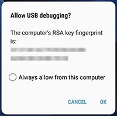
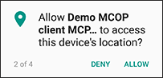
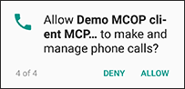
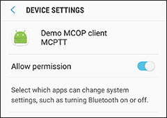
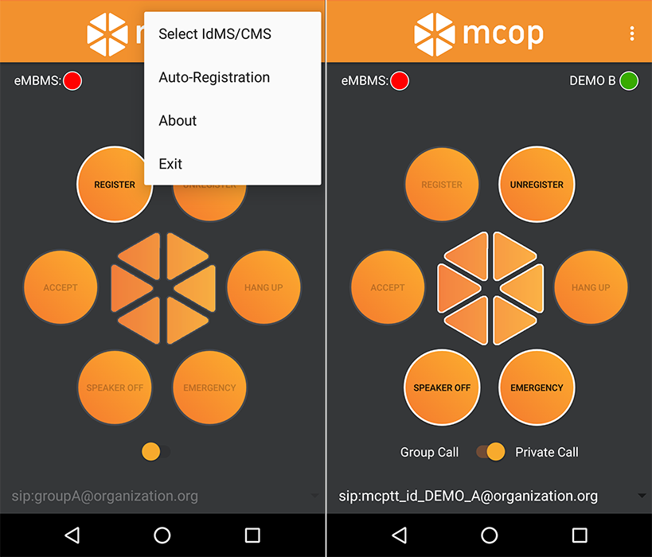

> *Refer to* [*README*](../README.md) *for main instruction file*

# MCOP MCPTT Client v2.0

## Installation

### Requirements

* [**MCOP SDK**](https://demo.mcopenplatform.org/gitlist/mcop/MCOP-SDK.git/blob/master/docs/MCOP_SDK_Installation.md) installed on the device.

* [**Provisioning Tool App**](ProvisioningTool.md) to configure the users and bypass the the SIM authentication.

### Download the MCOP MCPTT Demo Client

Clone or download the project:

	$ git clone mcop@demo.mcopenplatform.org:mcop/MCOP-MCPTT-Client.git

Enter the password: Iephieb8

### Install Android Studio

* Android Studio [User Guide](https://developer.android.com/studio/install).

* Download [Android Studio](https://developer.android.com/studio/).

### Install MCOP MCPTT Client

Import the project in Android Studio by selecting **File --> Open:** Select the **MCOP-MCPTT-Client** project folder.

Android **SKD Platform 28** is defined as compilation version. If not installed, a message is shown in Android Studio to *"Install missing platform(s) and sync project"*.

Connect a phone to the computer via USB cable. **USB debugging** mode must be previously activated, on phone *Settings --> Developer Options*. Once connected, click OK on *"Allow USB debugging?"* message.

Back on Android Studio, click on run , select the device to install the app, and click on Install and Continue.

Once installed, allow requested permissions:

 

 

### Usage

* As mentioned in the requirements above, the MCOP MCPTT Client needs both [**MCOP SDK**](https://demo.mcopenplatform.org/gitlist/mcop/MCOP-SDK.git/blob/master/docs/MCOP_SDK_Installation.md) and [**Provisioning Tool**](ProvisioningTool.md) installed to work.

* **IMPORTANT**: In order to test the MCOP MCPTT Client against our [demo.mcopenplatform.org](https://demo.mcopenplatform.org) testing platform, edit the configuration in the Provisioning Tool with the provided credentials, and activate the client to be registered with. **Full detailed information is available in the [Provisioning Tool](ProvisioningTool.md) documentation**.

* Once started, the MCOP MCPTT Client will show a quick message informing that it has correctly binded to the **MCOP SDK**.

* The client will load the configuration of the client made active in the **Provisioning Tool**.

* By default, auto-registration feature is disabled, so **REGISTER** button needs to be pressed to start the registration. Click on the menu button at the top right corner, and choose **Auto-Registration** to change this configuration.

* To use **IdMS/CMS** for registration, disabled by default, select the **IdMS/CMS** option of the menu. If enabled, an IdMS login window will show up when registering. In case of the [**MCOP Online Testing Platform**](https://demo.mcopenplatform.org/), this credentials will be provided by email when requesting a testing slot.

* Once succesfully registered, the Status button on the top right will turn green and show the **Display Name** of the registered user. The rest of the buttons of the graphic interface will also be enabled, making the client ready to receive and make calls.

* The swith button allows to select between private and prearranged group calls. When pressing (or keeping it pressed) the middle MCOP logo button, a call will be made according to the selected option.

* This middle MCOP logo button also works as push to talk button while on a call, changing the color to show whether the token is taken (red), granted (green) or idle (grey) during the call.

* The spinner button below shows a list of clients or groups to call. The list changes depending on the switch button that activates private or group calls. Both lists are hardcoded on the **MainActivity.java** file, and can be edited to match the clients ids of your configuration. In case of the group calls, the client will update the default list with the one received from the GMS.

* The speaker button allows to enable or dissable the speaker.

* The **Emergency** button enables the Emergency state. While in Emergency, all made calls will be made as emergency calls, and the receiver(s) will change their state to Emergency while the call lasts. The caller will remain in Emergency state till it is manually disabled.

* Check [MCOP MCPTT App Development](MCOP_App_developing_steps.md) guide for more info on app development using the MCOP SDK.

### Screenshots

### Possible Errors

* If you have SIP related problems, maybe your carrier is SBC/filtering VoIP traffic. Please check the [Troubleshooting - Network Issues](Troubleshooting.md) section for more information.
