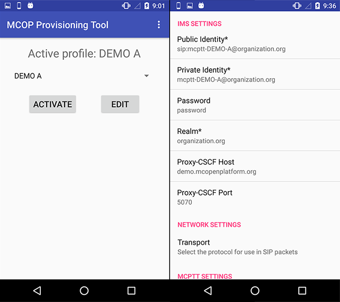

> *Refer to* [*README*](../README.md) *for main instruction file*

# MCOP Provisioning Tool

The MCOP Provisioning Tool has two main goals: bypass the SIM authentication and enter the MCPTT configuration.

## SIM Authentication

The MCOP Provisioning Tool is used to bypass the SIM authentication in order to test the **MCOP SDK** in those devices that don't have a proper SIM plugin due to privilege constraints.

It uses **AKAv2** (*Authentication and Key Agreement*, [*RFC 3310*](https://tools.ietf.org/html/rfc3310)) for authentication. AKA is a challenge-response based mechanism that uses symmetric cryptography.

### Response

The Provisioning Tool provides a response according to the standard specified in [ETSI TS 131 102](http://www.etsi.org/deliver/etsi_ts/131100_131199/131102/14.04.00_60/ts_131102v140400p.pdf) on section *7.1.2.1 GSM/3G security context*, in base64 format.

### Disclaimer

The Provisioning Tool internally uses **amf = 0x0000 (hex)** and **OP = 0x00000000000000000000000000000000 (hex)**.

## MCPTT Configuration

### Usage

Open the **MCOP Provisioning Tool** and select any of the preconfigured user profiles. Click on the Edit button to modify any of the parameters on any user. Then the desired profile can be activated.

The **MCOP SDK** or **MCOP MCPTT Client** will use the configuration on the activated profile the next time is opened.

## demo.mcopenplatform.org

The [**demo.mcopenplatform.org**](https://demo.mcopenplatform.org/) platform can be used for testing purposes. 

Click on [**Request Access**](https://demo.mcopenplatform.org/reserve) and check the calendar there for an empty slot, and you'll receive credentials for five test users (with suffixes A to E). Update the profiles in the Provisioning Tool with the provided configuration in order to test MCOP with our Online Testing Platform.

The **Name** field (max. 10 characters) in the form will determine the name of the client ID. Check the **Parameters** section below for a specific example.

### Parameters

* **IMPU**: IP Multimedia Public Identity.

		e.g. sip:mcptt-DEMO-A@organization.org

* **IMPI**: The IP Multimedia Private Identity used to authenticate.

		e.g. mcptt-DEMO-A@organization.org

* **PASSWORD**: A shared secret key for the authentication process.

		e.g. 0123456789

* **Realm**: Domain.

		e.g. organization.org

* **PcscfHost**: Host name or ip address of the P-CSCF (Proxy-Call Session Control Function).

		e.g. demo.mcopenplatform.org

* **PcscfPort**: Port number of the P-CSCF.

		e.g. 5070

* **Transport**: Transport protocol.

		e.g. TCP

* **McpttId**: MCPTT identifier.

		e.g. sip:mcptt_id_DEMO_A@organization.org

* **McpttClientId**: MCPTT Client identifier.

		e.g. sip:mcptt_id_DEMO_A@organization.org

## Installation

Download the **MCOP Provisioning Tool apk** from [here](https://demo.mcopenplatform.org/gitlist/mcop/MCOP-SDK.git/raw/master/provisioning/MCOP_ProvisioningTool.apk).

It can be installed directly from an Android device, or using [Android ADB](https://developer.android.com/studio/command-line/adb) from a computer.

## Screenshot
		

